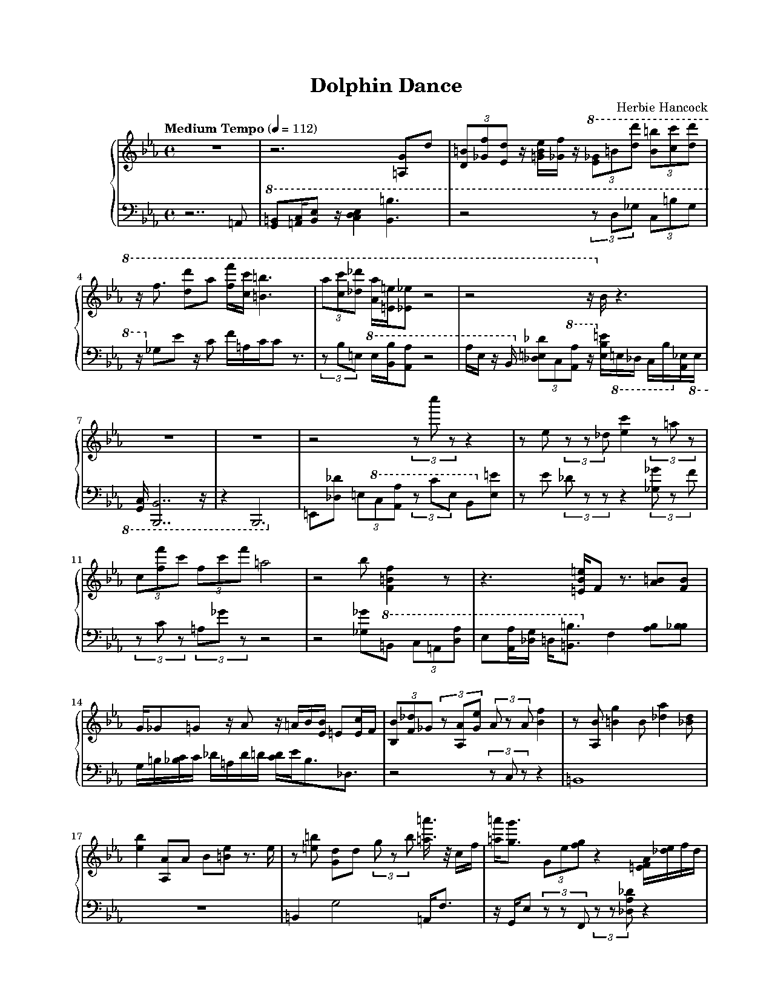

# AI Piano Transcriptor & Typesetting Pipeline

An end-to-end Python pipeline that transcribes piano performances from audio, maps rubato timings to a steady beat grid, resolves complex rhythms (including triplets), statefully splits notes between hands using physiological span constraints, and formats the output into clean, beautifully engraved LilyPond sheet music.

## Demo

* **Performance Reference**: [Herbie Hancock - Dolphin Dance (Piano Solo) on YouTube](https://www.youtube.com/watch?v=L3WXPd6_IuA)
  
  [](https://www.youtube.com/watch?v=L3WXPd6_IuA)

* **Typeset Outputs**:
  - **Extracted MIDI**: [dolphin_dance_human.mid](samples/dolphin_dance_human.mid) (Warped and Quantized Performance)
  - **Typeset PDF Score**: [dolphin_dance_human.pdf](samples/dolphin_dance_human.pdf) (LilyPond Typeset Sheet Music)

### First Page Score Preview


***

## Features & Heuristics

This project contains several custom heuristics designed to output sheet music that matches human-typeset readability standards.

### 1. Adaptive Rhythm Quantization
Rather than using a rigid grid (which rounds triplets to 16th notes and creates unreadable notation), the pipeline dynamically analyzes note onset distributions beat-by-beat:
* It groups note onsets by beat index.
* It calculates the **Inter-Onset Intervals (IOI)** within each beat.
* Beats are classified into **TRIPLET**, **16TH**, or **8TH** grids:
  - If a beat contains 3 onsets spaced by $\sim 0.33$ beats, it is quantized on a 3-division grid.
  - If it contains 4 or more onsets, it is quantized on a 4-division grid.
* Snapped offsets are translated directly to canonical LilyPond `\tuplet 3/2` values or standard power-of-2 note lengths.

### 2. Stateful Hand-Splitting Heuristic
Notes are distributed between the treble (Right Hand) and bass (Left Hand) staves using a cost-based optimizer that enforces three constraints:
1. **Physical Span Limit**: Enforces a maximum reach per hand (capped at 16 semitones, i.e., a tenth). Inner notes are dropped or moved if they exceed this.
2. **Stateful Voice Tracking**: Tracks the running center-of-gravity (average pitch) of each hand. Notes that form a continuous melody line are kept in the same hand to prevent arbitrary staff hopping.
3. **Clef Gravity**: Applies a mild bias pulling pitches above D4 to the treble staff and pitches below D4 to the bass staff.

### 3. Staff Consolidation (Post-Processing Hand-Merging)
To make the score highly readable and prevent empty measures or unnecessary double-staff complexity, a post-processing pass merges notes into a single staff when:
* All active notes at a given time fit within the hand-span of a single hand.
* The merge does not disrupt a continuous voice running in the other hand.
This results in clean, single-clef passages for solo melodies and consolidates chords elegantly.

### 4. Stateful Multi-Threshold Hysteresis Ottava Brackets
To prevent staves from overflowing with ledger lines, independent `8va` and `8vb` brackets are applied to both staves using a hysteresis-like trigger/release model:
* **Treble 8va**: Triggered when a pitch reaches $\ge$ B5 (MIDI 83), and sustained until pitches drop below G5 (MIDI 79).
* **Bass 8vb / 8va**: The bass clef independently applies `8vb` for extremely low notes ($\le$ C2 / MIDI 36) and `8va` for high tenor lines ($\ge$ G3 / MIDI 55).
* A minimum duration threshold (1.5 beats) and minimum note count (3 notes) are enforced to prevent rapid, flickering on/off bracket changes.

### 5. Clean Rest Decomposition
Gaps between notes are dynamically filled by decomposing the remaining beats into standard, readable rest values (e.g., quarter rest, dotted eighth, sixteenth rest) to prevent complex, triple-dotted rest combinations that confuse human readers.

***

## Prerequisites

1. **Python 3.8+**
2. **LilyPond**: Required to compile the generated `.ly` files into `.pdf` and `.midi`. Install via Homebrew on macOS:
   ```bash
   brew install lilypond
   ```

## Installation

Clone the repository and install the dependencies:
```bash
pip install -r requirements.txt
```

## Usage

You can run the entire pipeline (transcription, warping, quantization, splitting, and engraving) using the unified `main.py` entrypoint:

```bash
python main.py --input-audio path/to/piano_solo.wav --output-ly score.ly --bpm 112 --key-flats 3 --title "Dolphin Dance" --composer "Herbie Hancock"
```

### Options:
* `--input-audio`: Path to input WAV/MP3 file.
* `--input-midi`: Use an existing raw MIDI file directly (skipping Phase 1 transcription).
* `--bpm`: Target steady tempo in BPM.
* `--key-flats`: Number of flats in the key signature (0-7).
* `--key-sharps`: Number of sharps in the key signature (0-7).
* `--title`: Title of the piece.
* `--composer`: Composer name.
* `--custom-beats`: Path to a text file containing performance beat time markers (one float per line) to warp rubato recordings.
* `--skip-synthesis`: Skip synthesizing the warped MIDI output.

### Verify Transcription:
To verify the transcription's note accuracy against the reference/performance MIDI:
```bash
python compare.py --reference warped.mid --transcribed compiled_lilypond.midi --bpm 112
```
